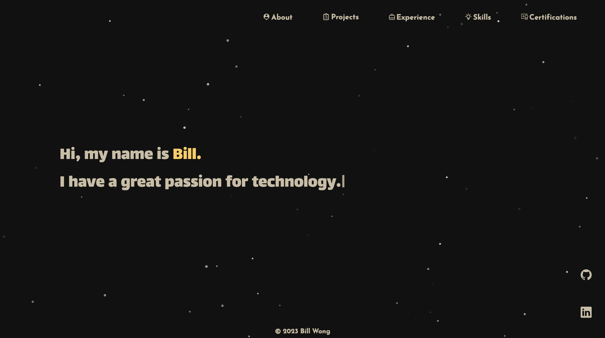
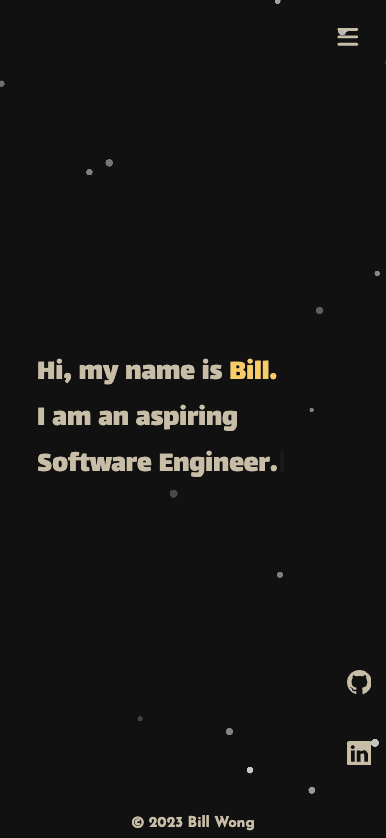
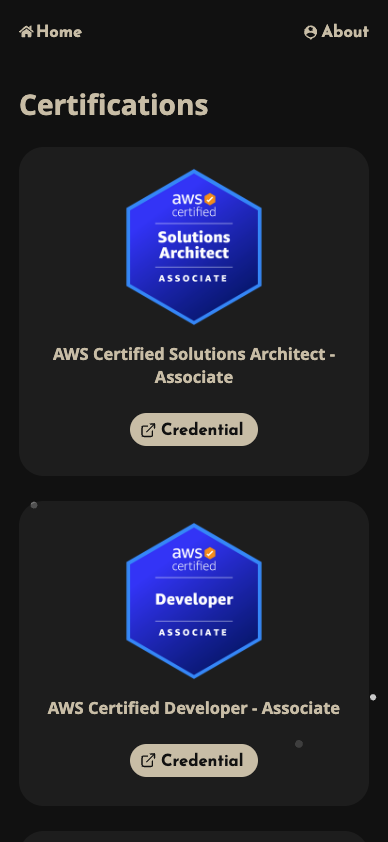

# **Personal Website** - [_Link Here_](https://billw.info/)

This is my new developer portfolio website.

## Background

I built my [first personal website](https://billwonggg.github.io) using plain HTML, CSS and vanilla JavaScript. It has been quite a while since then and I have decided to now upgrade the website to a React TypeScript framework with SCSS. This makes the project a lot more scalable and easier to maintain with type checking and re-usable functional components.

## Features

- Created page transitions with framer motion.
- Animated stars background with tsParticles.
- Engaging typewriter effect in the home page.
- Interactive icon cloud in the skills page.
- Animations when interacting with links, images, and buttons.
- Responsive webpage design, optimised for mobile experiences.

## Preview

### _Desktop_

### _Mobile_

 
    
    
    

